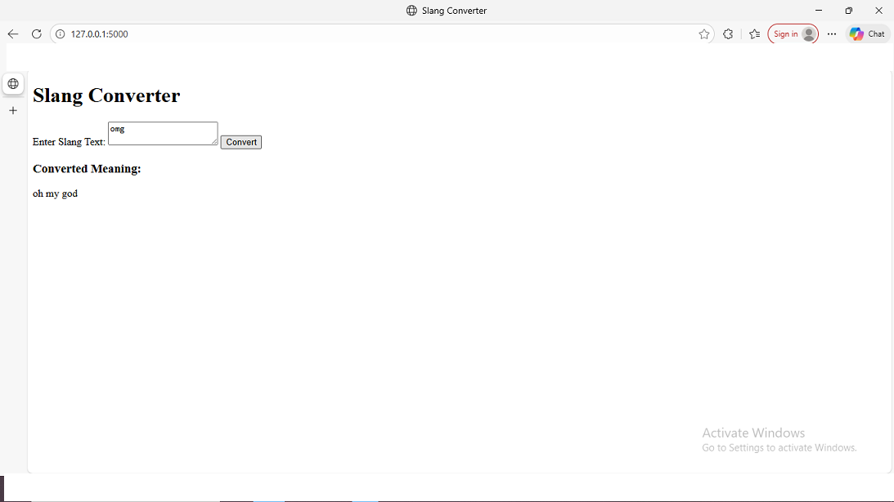
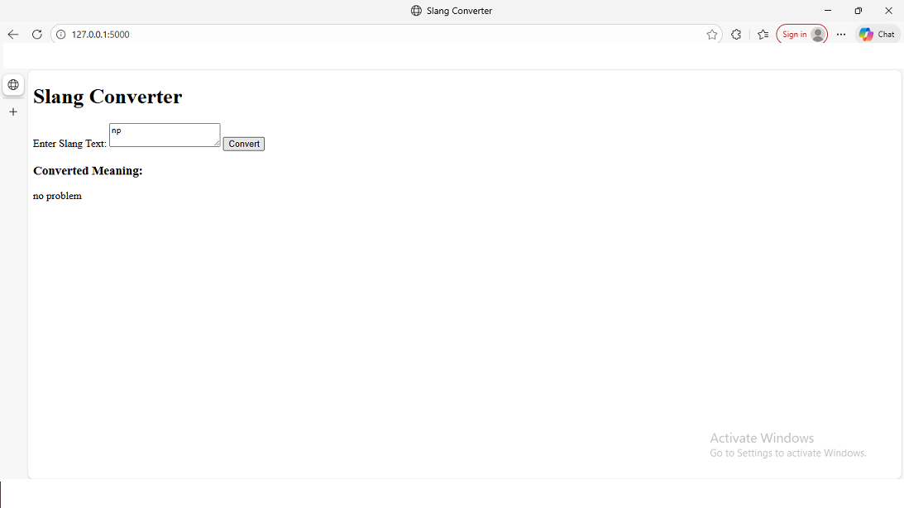

# Slang Converter 🔤

A Flask-based web application that converts slang words into their meanings.

## 🚀 Features
- Converts English slang words
- Simple and clean UI
- Built using Flask and Python
- Uses CSV-based slang dictionaries

## 🖼️ Application Screenshots

### Slang Conversion Example



### Another Example



## 🛠️ Technologies Used
- Python
- Flask
- HTML/CSS
- Pandas

## ▶️ How to Run
```bash
pip install -r requirements.txt
python app.py
